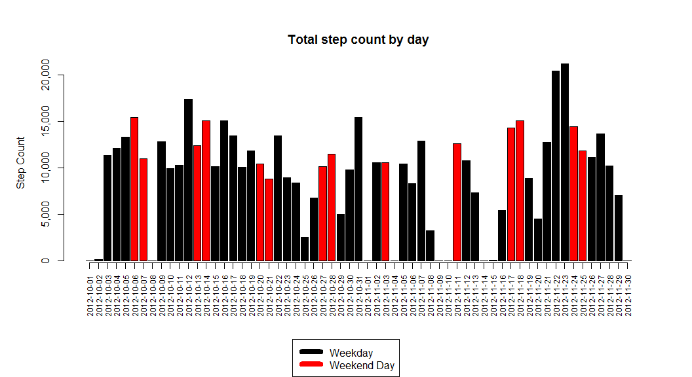
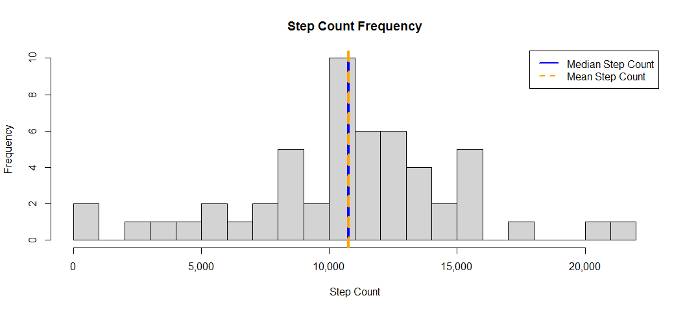
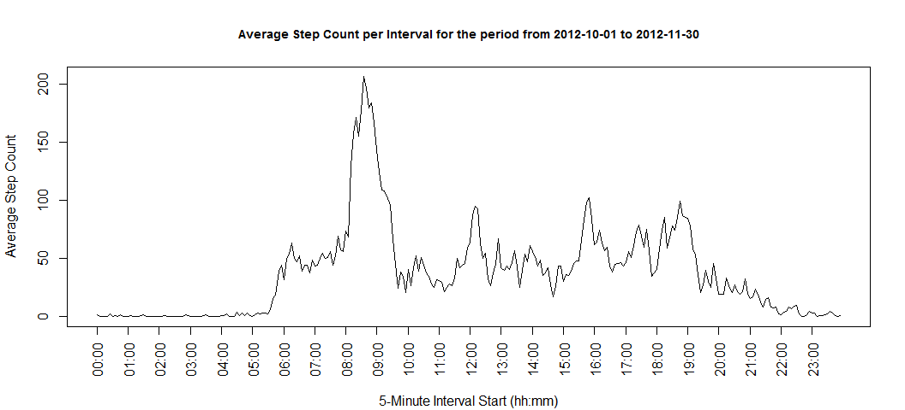
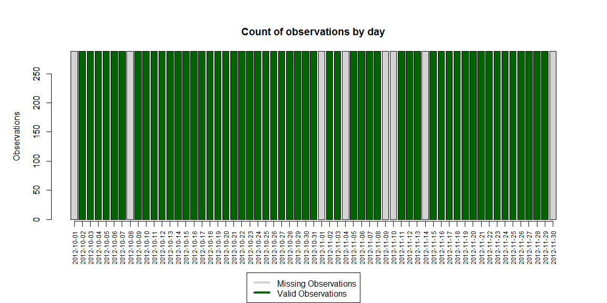
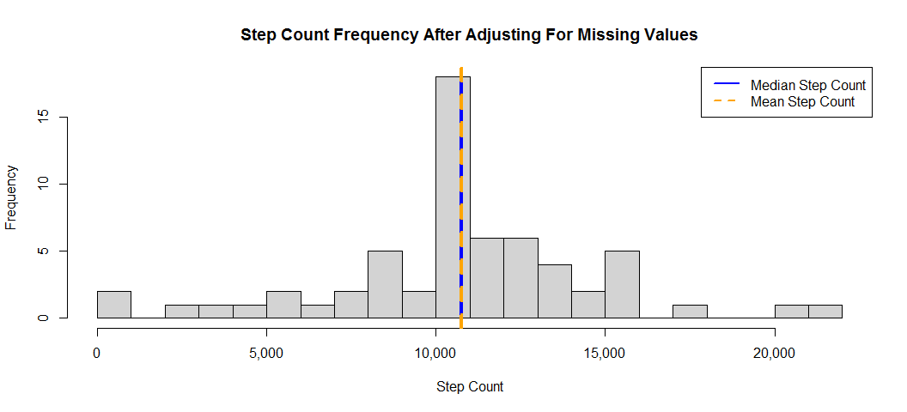
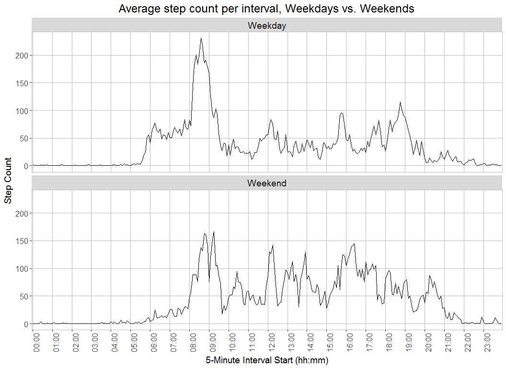

# Activity Monitoring Data Analysis
David M. Leonard  
April 2nd, 2017  
<style type="text/css">

body{ /* Normal  */
   font-size: 18px;
}
</style>


```r
ad <- read.csv("activity.csv", stringsAsFactors = F)
ad$date <- as.Date(ad$date)
ad$DoW <- weekdays(ad$date)
ad[,"Wknd"] <- NA  # Create a new column to indicate weekdays vs. weekend days
ad[ad$DoW %in% c("Saturday","Sunday"),"Wknd"] <- "Weekend"
ad[!(ad$DoW %in% c("Saturday","Sunday")),"Wknd"] <- "Weekday"
ad$Wknd <- as.factor(ad$Wknd)
days <- length(unique(ad$date))
firstday <- min(unique(ad$date))
lastday <- max(unique(ad$date))

# interval looks like an integer but is actually of the form hhmm, 
# but leading zeroes are not included; clean it up for display

ad$interval <- paste("000",as.character(ad$interval),sep="")
intstart <- nchar(ad$interval)-3
ad$interval <- substring(ad$interval,intstart)
ad$interval <- paste(substring(ad$interval,1,2),substring(ad$interval,3),sep=":")

totalobs <- length(ad$interval)
naobs <- length(ad[is.na(ad$steps),"interval"])
napct <- as.integer(floor(.5 + (100*naobs/totalobs)))
```
## Loading and preprocessing the data

This report analyzes activity monitoring data collected over a period of 61 days, from 2012-10-01 to 2012-11-30. The data consists of a count of steps taken in five minute intervals throughout each day by the wearer of a monitoring device, for a total of 17,568 possible observations; however, 2,304 (13%) of the intervals had no measurements.

## What is the mean total number of steps taken per day?

The chart below shows the number of steps counted each day.


```r
stepsbyday <- ad %>% 
    group_by(date,Wknd) %>% 
    summarize(steps = sum(steps, na.rm = TRUE))
mediandailysteps <- median(stepsbyday$steps)
maxdailysteps <- max(stepsbyday$steps)
dailysteps <- mean(stepsbyday$steps)
par(oma = c(4,1,1,1))
stepplot <- barplot(stepsbyday$steps, 
                  col=stepsbyday$Wknd, 
                  main = "Total step count by day",
                  ylab = "Step Count",
                  yaxt = "n")
axis(1,at = stepplot, labels = stepsbyday$date, las = 3, cex.axis = .75)
axis(2,at = axTicks(2), labels = formatC(axTicks(2), format = "d", big.mark = ","))
par(fig = c(0, 1, 0, 1), oma = c(0, 0, 0, 0), mar = c(0, 0, 0, 0), new = TRUE)
plot(0, 0, type = "n", bty = "n", xaxt = "n", yaxt = "n")
legend("bottom",bg = "white", 
       legend = c("Weekday", "Weekend Day"), 
       col = c(1,2), 
       lwd = 8)
```

<!-- -->

Ignoring intervals with no reported values, the average daily step count over the 61 day measurement period was 9,354, and the median step count was 10,395. The chart below shows the distribution of step counts. The most frequent step count was between 10,000 and 11,000 steps.


```r
mediancolor = "blue"
meancolor = "dark red"
hist(stepsbyday$steps, 
     breaks = floor(maxdailysteps/1000),
     col="light grey", 
     main = "Step Count Frequency",
     ylab = "Frequency",
     xlab = "Step Count",
     xaxt = "n",
     yaxt = "n")
axis(1,at = axTicks(1),
      labels = formatC(axTicks(1), format = "d", big.mark = ","))
axis(2,at = axTicks(2),
      labels = formatC(axTicks(2), format = "d", big.mark = ","))
abline(v=mediandailysteps, col = mediancolor, lwd = 4, lty = 1)
abline(v=dailysteps, col = meancolor, lwd = 4, lty = 2)
legend("topright",bg = "white", 
       legend = c("Median Step Count", "Mean Step Count"), 
       col = c(mediancolor,meancolor), 
       lwd = 2,
       lty = c(1,2))
```

<!-- -->

## What is the average daily activity pattern?

```r
intavg <- ad %>% 
    group_by(interval) %>% 
    summarize(avgsteps = mean(steps, na.rm = T)) 
maxinterval <- intavg %>% filter(avgsteps == max(avgsteps)) %>% select(interval, avgsteps)
maxtime <- maxinterval$interval[1]
maxsteps <- formatC(round(maxinterval$avgsteps[1]), big.mark = ",")
```

The plot below shows the step count by interval over the course of an average day.


```r
intavgTitle <- paste("Average Step Count per Interval for the period from",firstday,"to",lastday)
plot(intavg$avgsteps, type = "l", 
     xlab = "", 
     ylab = "Average Step Count",
     main = intavgTitle, cex.main = .9, 
     xaxt = "n",
     yaxt = "n")
mtext("5-Minute Interval Start (hh:mm)", side = 1, line = 4)
lpos <- seq(1,length(intavg$interval),12)
pl <- intavg$interval[lpos]
axis(1,at = lpos, labels = pl, las = 3, cex.axis=1)
axis(2,at = axTicks(2), 
     labels = formatC(axTicks(2), format = "d", big.mark = ","))
```

<!-- -->

For the time period in question, the daily 5-minute interval starting at 08:35 had the highest average step count, which was 206 steps.

## Imputing missing values
As mentioned earlier, 13% of observations were missing from the data. These missing values are isolated to 8 separate days for which there were no measurements at all, while the remaining days all had a full set of values (see chart below).

```r
countsbyday <- ad %>% 
    group_by(date) %>% 
    summarize(naobs = sum(is.na(steps)), stepobs = sum(!is.na(steps)))

par(oma = c(3,1,1,1))
naplot <- barplot(countsbyday$naobs, 
                  col="light grey", 
                  main = "Count of observations by day",
                  ylab = "Observations")
par(new=TRUE)
barplot(countsbyday$stepobs, col="dark green")
axis(1,at = naplot, labels = countsbyday$date, las = 3, cex.axis = .75)

par(fig = c(0, 1, 0, 1), oma = c(0, 0, 0, 0), 
    mar = c(0, 0, 0, 0), new = TRUE)
plot(0, 0, type = "n", bty = "n", xaxt = "n", yaxt = "n")
legend("bottom",
       cex = 1,
       pt.cex = 1.25,
       bg = "white",
       lty = 1,
       lwd = 4,
       legend = c("Missing Observations","Valid Observations"), 
       col = c("light grey","dark green"))
```

<!-- -->

To adjust for missing values, I chose to fill in using the average value for the given interval over the entire sample period. The chart below shows the resulting new distribution of step counts.


```r
adf <- inner_join(ad, intavg, by = "interval")
adf[is.na(adf$steps), "steps"] <- as.integer(round(adf[is.na(adf$steps), "avgsteps"]))

stepsbydayf <- adf %>% 
    group_by(date,Wknd) %>% 
    summarize(steps = sum(steps))
mediandailystepsf <- median(stepsbydayf$steps)
maxdailystepsf <- max(stepsbydayf$steps)
dailystepsf <- sum(adf$steps)/days

mediancolor = "blue"
meancolor = "orange"
hist(stepsbydayf$steps, 
     breaks = floor(maxdailystepsf/1000),
     col="light grey", 
     main = "Step Count Frequency After Adjusting For Missing Values",
     ylab = "Frequency",
     xlab = "Step Count",
     xaxt = "n",
     yaxt = "n")
axis(1,at = axTicks(1),
      labels = formatC(axTicks(1), format = "d", big.mark = ","))
axis(2,at = axTicks(2),
      labels = formatC(axTicks(2), format = "d", big.mark = ","))
abline(v=mediandailystepsf, col = mediancolor, lwd = 4, lty = 1)
abline(v=dailystepsf, col = meancolor, lwd = 4, lty = 2)
legend("topright",bg = "white", 
       legend = c("Median Step Count", "Mean Step Count"), 
       col = c(mediancolor,meancolor), 
       lwd = 2,
       lty = c(1,2))
```

<!-- -->
After adjusting for missing values, the mean and median daily step counts have converged; the mean daily step count for the 61 day period is now 10,765, or 15% higher than the unadjusted data suggested, while the median count has risen to 10,762. (Note that had we taken the original total step count and divided by the number of days with no missing observations we would have gotten the same average value we see in the corrected data.)

## Are there differences in activity patterns between weekdays and weekends?


```r
intavgWD <- adf %>% filter(Wknd == "Weekday") %>%
    group_by(interval) %>% 
    summarize(avgsteps = mean(steps)) 
maxintervalWD <- intavgWD %>% filter(avgsteps == max(avgsteps)) %>% select(interval, avgsteps)
maxtimeWD <- maxintervalWD$interval[1]
maxstepsWD <- formatC(round(maxintervalWD$avgsteps[1]), big.mark = ",")
meanWDsteps <- sum(intavgWD$avgsteps)

intavgWE <- adf %>% filter(Wknd == "Weekend") %>%
    group_by(interval) %>% 
    summarize(avgsteps = mean(steps)) 
maxintervalWE <- intavgWE %>% filter(avgsteps == max(avgsteps)) %>% select(interval, avgsteps)
maxtimeWE <- maxintervalWE$interval[1]
maxstepsWE <- formatC(round(maxintervalWE$avgsteps[1]), big.mark = ",")
meanWEsteps <- sum(intavgWE$avgsteps)
```

The chart below compares the average step count per interval during weekdays and on weekends, using the data adjusted for missing values.


```r
intavgf <- adf %>% 
    group_by(interval, Wknd) %>% 
    summarize(avgsteps = mean(steps)) 
maxintervalf <- intavgf %>% filter(avgsteps == max(avgsteps)) %>% select(interval, avgsteps)
maxtimef <- maxintervalf$interval[1]
maxstepsf <- formatC(maxintervalf$avgsteps[1], big.mark = ",")

g <- ggplot(intavgf, aes(interval,avgsteps, group=1))
g + facet_wrap(~Wknd, ncol=1) + 
    geom_line() + 
    ggtitle("Average step count per interval, Weekdays vs. Weekends") +
    xlab ("5-Minute Interval Start (hh:mm)") + ylab("Step Count") +
    theme(axis.text.x = element_text(angle = 90, size = 12),
          axis.text.y = element_text(size = 12),
          axis.title = element_text(size=14),
          plot.title = element_text(size=18, hjust = .5),
          strip.text.x = element_text(size = 14),
          panel.grid.major = element_line(colour = "grey"),
          panel.background = element_rect(fill = 'white', colour = 'grey')) +
    scale_x_discrete(breaks = unique(intavgf$interval)[c(T, rep(F, 11))])
```

<!-- -->

For weekdays (Monday through Friday), the daily 5-minute interval starting at 08:35 had the highest average step count, which was 230 steps. On weekend days (Saturday and Sunday), the daily 5-minute interval starting at 09:15 had the highest average step count, which was 167 steps, but a second peak occurs a few intervals earlier. On weekdays, the average step count is 10,255, while on weekends it is 12,201.
